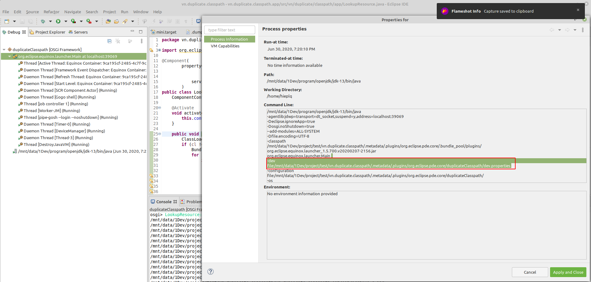

# Demo project for duplicate classpath by dev mode of eclipse
when run a Osgi project (osgi framework or eclipse application) from eclipse  
eclipse append [-dev](https://help.eclipse.org/2020-06/index.jsp) to add more classpath  



this's sample content for this project  
```
#
#Tue Jun 30 19:20:10 ICT 2020
vn.duplicate.classpath.app=bin
@ignoredot@=true
vn.duplicate.classpath.lib=lib/breeze.jar,lib/calendar.jar,lib/closure-compiler.jar,lib/gmapsz.jar,lib/iceblue_c.jar,lib/timelinez.jar,lib/timeplotz.jar,bin
```

jar library also add to dev classpath make duplicate  
this project to figure it out


# how to run demo to figure it out
1. git clone git@github.com:hieplq/vn.duplicate.classpath.git
1. open eclipse 2020-06 choose vn.duplicate.classpath as workspace
1. import exists project vn.duplicate.classpath.app and vn.duplicate.classpath.lib
1. open and active target vn.duplicate.classpath.app/mini.target
1. open debug configuration, create new launch from of OSGI Framework
1. run that launch
1. at console type LookupResource:lookup
1. console show list classpath of vn.duplicate.classpath.lib

can see dupplicate of all jar library
```
osgi> LookupResource:lookup  
/mnt/data/1Dev/project/test/vn.duplicate.classpath/vn.duplicate.classpath.lib/lib/breeze.jar  
/mnt/data/1Dev/project/test/vn.duplicate.classpath/vn.duplicate.classpath.lib/lib/calendar.jar  
/mnt/data/1Dev/project/test/vn.duplicate.classpath/vn.duplicate.classpath.lib/lib/closure-compiler.jar  
/mnt/data/1Dev/project/test/vn.duplicate.classpath/vn.duplicate.classpath.lib/lib/gmapsz.jar  
/mnt/data/1Dev/project/test/vn.duplicate.classpath/vn.duplicate.classpath.lib/lib/iceblue_c.jar  
/mnt/data/1Dev/project/test/vn.duplicate.classpath/vn.duplicate.classpath.lib/lib/timelinez.jar  
/mnt/data/1Dev/project/test/vn.duplicate.classpath/vn.duplicate.classpath.lib/lib/timeplotz.jar  
/mnt/data/1Dev/project/test/vn.duplicate.classpath/vn.duplicate.classpath.lib  
/mnt/data/1Dev/project/test/vn.duplicate.classpath/vn.duplicate.classpath.lib/lib/breeze.jar  
/mnt/data/1Dev/project/test/vn.duplicate.classpath/vn.duplicate.classpath.lib/lib/calendar.jar  
/mnt/data/1Dev/project/test/vn.duplicate.classpath/vn.duplicate.classpath.lib/lib/closure-compiler.jar  
/mnt/data/1Dev/project/test/vn.duplicate.classpath/vn.duplicate.classpath.lib/lib/gmapsz.jar  
/mnt/data/1Dev/project/test/vn.duplicate.classpath/vn.duplicate.classpath.lib/lib/iceblue_c.jar  
/mnt/data/1Dev/project/test/vn.duplicate.classpath/vn.duplicate.classpath.lib/lib/timelinez.jar  
/mnt/data/1Dev/project/test/vn.duplicate.classpath/vn.duplicate.classpath.lib/lib/timeplotz.jar  
/mnt/data/1Dev/project/test/vn.duplicate.classpath/vn.duplicate.classpath.lib  
osgi> 
```
